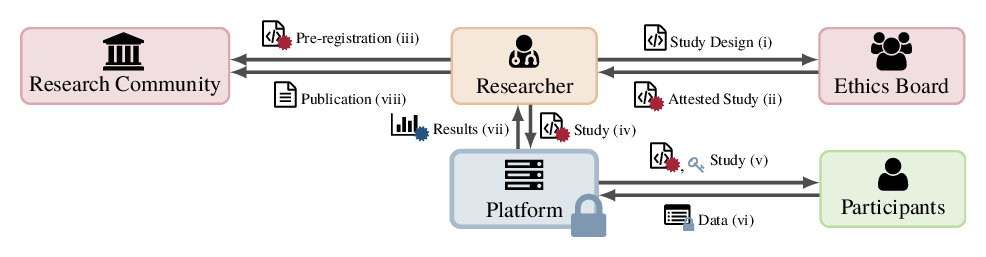

[](https://doi.org/10.1145/3412841.3441997) [](https://github.com/vs-uulm/peqes/blob/master/LICENSE)

# PeQES: A Platform for Privacy-enhanced Quantitative Empirical Studies

> Empirical sciences and in particular psychology suffer a methodological crisis due to the non-reproducibility of results, and in rare cases, questionable research practices.
> Pre-registered studies and the publication of raw data sets have emerged as effective countermeasures.
> However, this approach represents only a conceptual procedure and may in some cases exacerbate privacy issues associated with data publications.
> We establish a novel, privacy-enhanced workflow for pre-registered studies.
> We also introduce PeQES, a corresponding platform that technically enforces the appropriate execution while at the same time protecting the participants' data from unauthorized use or data repurposing.
> Our PeQES prototype proves the overall feasibility of our privacy-enhanced workflow while introducing only a negligible performance overhead for data acquisition and data analysis of an actual study.
> Using trusted computing mechanisms, PeQES is the first platform to enable privacy-enhanced studies, to ensure the integrity of study protocols, and to safeguard the confidentiality of participants' data at the same time.

This repository contains source code artifacts, experiments, and results associated with our SAC'21 publication.

For further details, please refer to:

Dominik Meißner, Felix Engelmann, Frank Kargl, and Benjamin Erb. 2021. **PeQES: A Platform for Privacy-enhanced Quantitative Empirical Studies**.
In The 36th ACM/SIGAPP Symposium on Applied Computing (SAC ’21), March 22–26, 2021, Virtual Event, Republic of Korea. ACM, New York, NY, USA, 9 pages. https://doi.org/10.1145/3412841.3441997

<br /><br />
Figure 1: The privacy-enhanced workflow for quantitative empirical studies that is implemented in PeQES.

## Repository Structure
 * [`build-environment/`](build-environment) - Dockerfile that describes the build environment necessary to build `peqes-server`.
 * [`evaluation/`](evaluation) - evaluation artifacts to reproduce results and results featured in our SAC'21 publication (see [Evaluation](#evaluation)).
 * [`peqes-client/`](peqes-client) - command line client to approve studies and remotely attest the platform
 * [`peqes-runner/`](peqes-runner) - application to run the PeQES platform SGX enclave
 * [`peqes-server/`](peqes-server) - Rust codebase of the PeQES enclave
 * [`peqes-webapp/`](peqes-webapp) - Vue.js-based web frontend for the PeQES platform
 * [`results/`](results) - our raw evaluation results as reported in our SAC'21 publication.

## Evaluation
To assess the practicability of our proof-of-concept prototype, we have evaluated the performance of the PeQES platform.
The evaluation in this repository follows the [Popper convention](https://getpopper.io/) for reproducible evaluations.
Our raw evaluation results are located in the [`results/`](results) directory (see [Reproducing Results](#reproducing-results) for an explanation of the files in this directory).

### Reproducing Results
The Popper workflow in this repository can be used to replicate results, compute statistics, and generate a box plot from the evaluation results.
The workflow requires a system that supports SGX, i.e. having the SGX driver installed and loaded (`/dev/isgx`) and the AESM service running (`/var/run/aesmd`). 
Assuming both [Docker](https://www.docker.com/) and the [Popper CLI tool](https://getpopper.io/) are installed you can simply call `popper run` in the root directory of the repository to run the workflow.

Our Popper workflow (see [`.popper.yml`](.popper.yml)) consists of two steps:
 * `build` - Compiles the PeQES platform to provide the executables for the next step.
 * `measure` - Runs the latency and computation experiment and prepares the results for the next step.
 * `analyze` - Computes basic statistics on the data collected in the previous step and generates the box/bar plots.

Post execution the [`results/`](results) directory will contain the following files:
 * [`computation.pdf`](results/computation.pdf) - A bar plot comparing the computation times of the baseline implementation and the SGX implementation.
 * [`computation-stats.csv`](results/computation-stats.csv) - Basic statistics of the measured computation times.
 * [`latency.pdf`](results/latency.pdf) - A box plot comparing submission latency of the baseline implementation and the SGX implementation
 * [`latency-stats.csv`](results/latency-stats.csv) - Basic statistics of the measured submission latencies.

## Compiling the PeQES Server
Due to some delicate dependencies the build environment requires a specific version of Clang.
For simplicity we added a Dockerfile that sets up the necessary build environment to build the PeQES server.

```sh
docker build -t peqes-build-environment build-environment
docker run --rm -v "$(pwd)/peqes-server:/app" -w /app peqes-build-environment make all
```

## Citation
If you find our work useful in your research, consider citing our paper:

```bibtex
@inproceedings{meissner2021peqes,
    title = {PeQES: A Platform for Privacy-enhanced Quantitative Empirical Studies},
    author = {Meißner, Dominik and Engelmann, Felix and Kargl, Frank and Erb, Benjamin},
    isbn = {978-1-4503-8104-8/21/03},
    publisher = {ACM},
    url = {https://doi.org/10.1145/3412841.3441997},
    doi = {10.1145/3412841.3441997},
    booktitle = {The 36th ACM/SIGAPP Symposium on Applied Computing},
    year = {2021},
    month = {03},
    location = {Virtual Event, Republic of Korea},
    series = {SAC '21}
}
```

## License
The PeQES prototype and related artifacts are licensed under the terms of the [MIT license](LICENSE).
